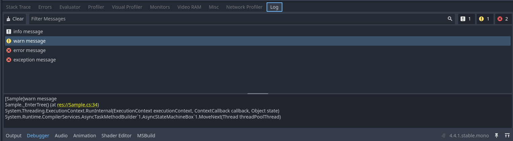
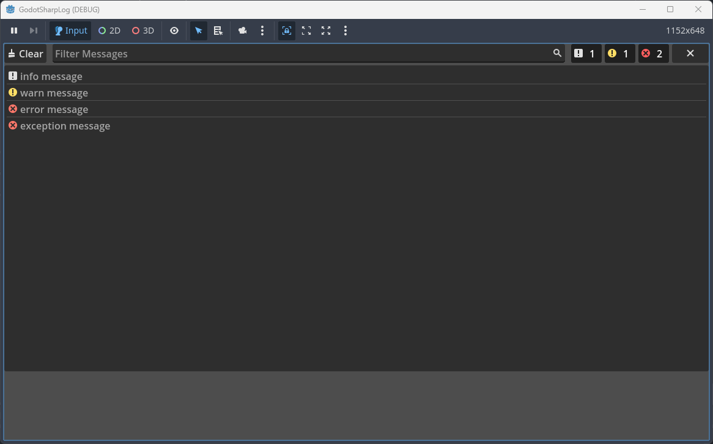

<p align="center">
  English | <a href="./Readme_CN.md">中文 </a><br>
</p>

# GodotSharpLog

GodotSharpLog is a logging tool designed for Godot C#, aiming to help developers manage log information more conveniently in different scenarios.

## Features

- **Native Output**: Supports outputting log information to Godot's output and debugger panels.
- **File Logging**: Supports writing log information to files.
- **Built-in Logging**: Provides runtime logging and a runtime visual log interface.




## Usage Example
init log agents in your project's main scene
```csharp
var fileLogAgent = new FileLogAgent(); // File Logging
fileLogAgent.Cleanup(2); // Keep 2 log files, delete the rest
GLog.AddAgent(fileLogAgent);

if (EngineDebugger.IsActive())
{
    var debuggerLogAgent = new DebuggerLogAgent(); // Output log information to Godot's debugger panel
    GLog.AddAgent(debuggerLogAgent);
}
else
{
    var godotLogAgent = new GodotLogAgent(); // Output log information to Godot's output panel
    GLog.AddAgent(godotLogAgent);
}

var builtinLogAgent = new BuiltinLogAgent(); // Built-in Logging
GLog.AddAgent(builtinLogAgent);

GLog.Info("info message", "Sample");
GLog.Warn("warn message", "Sample");
GLog.Error("error message", "Sample");
GLog.Exception(new Exception("exception message"), "Sample");
```