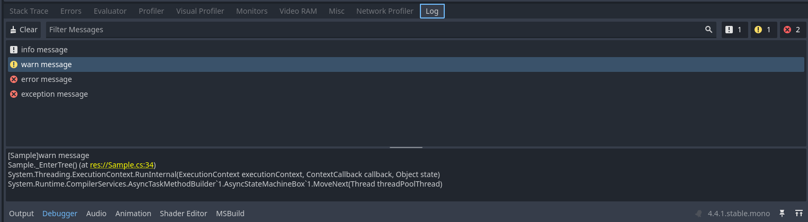

<p align="center">
  <a href="./Readme.md">English</a> | 中文<br>
</p>
# GodotSharpLog

GodotSharpLog 是一个为 Godot C# 设计的日志记录工具，旨在帮助开发者更方便地管理不同场景下的日志信息。

## 功能特性

- **原生输出**：支持将日志信息输出到 Godot 的输出和调试面板。
- **文件日志**：支持将日志信息写入文件。
- **内置日志**：提供运行时日志记录，运行时可视化日志界面。




## 使用示例
在游戏入口初始化日志代理
```csharp
var fileLogAgent = new FileLogAgent(); // 将日志信息写入文件
fileLogAgent.Cleanup(2); // 保留2个日志文件，其余清空
GLog.AddAgent(fileLogAgent);

if (EngineDebugger.IsActive())
{
    var debuggerLogAgent = new DebuggerLogAgent(); // 将日志信息输出到 Godot 的调试器面板
    GLog.AddAgent(debuggerLogAgent);
}
else
{
    var godotLogAgent = new GodotLogAgent(); // 将日志信息输出到 Godot 的输出面板
    GLog.AddAgent(godotLogAgent);
}

var builtinLogAgent = new BuiltinLogAgent(); // 运行时可视化界面
GLog.AddAgent(builtinLogAgent);

GLog.Info("info message", "Sample");
GLog.Warn("warn message", "Sample");
GLog.Error("error message", "Sample");
GLog.Exception(new Exception("exception message"), "Sample");
```